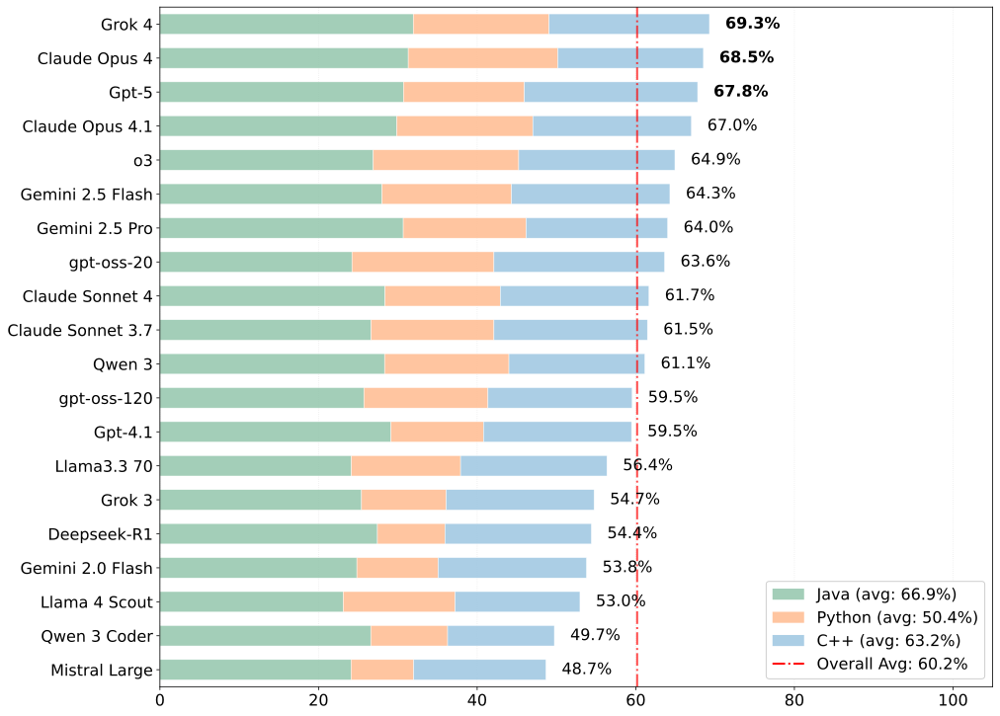
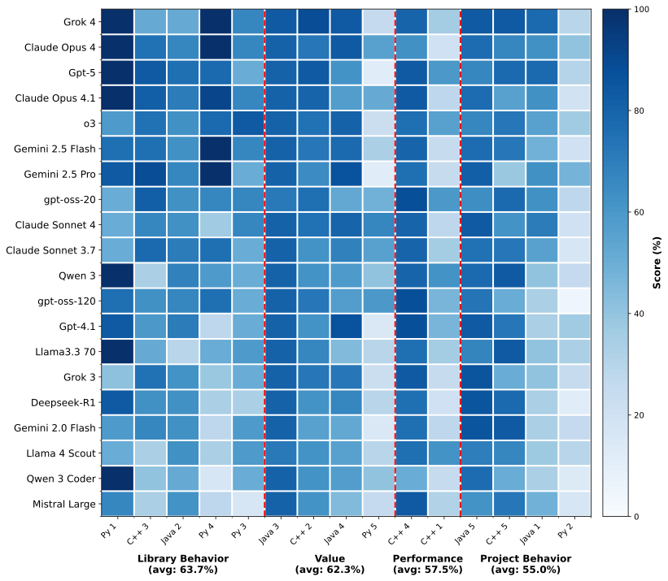
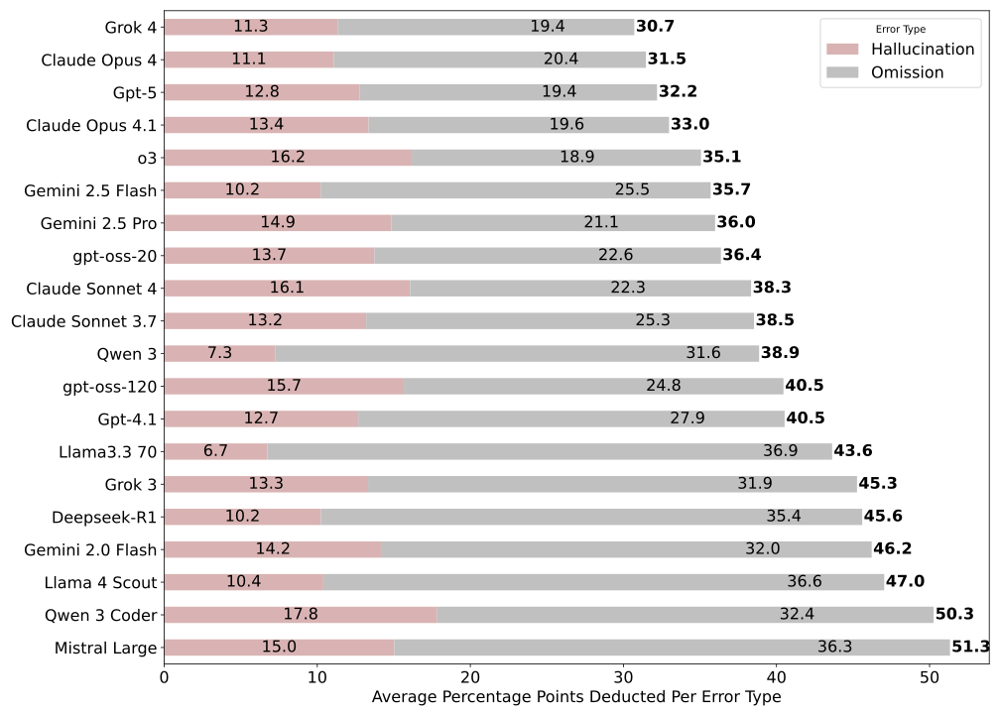

# RubberDuckBench: A Benchmark for AI Coding Assistants

    

RubberDuckBench is a multilingual benchmark of questions about code, along with detailed rubrics for evaluating ansewrs. We intend this benchmark to be a target for future research in trustworthy and correct AI coding assistants.

## Dataset 

Our benchmark contains 15 questions evenly split between each language: Java, Python, and C++. Each question is contextualized in a particular project, git commit, and line number. Our artifact includes scripts to automatically clone and checkout the necessary context. Each question also includes a detailed rubric and minimal script which exemplifies the answer. See the `dataset` folder for more details.

## Evaluation 

  

<em>Figure 1a: Model Performance</em>

  

<em>Figure 1d: Question Heatmap</em>

  

<em>Figure 6: Average Hallucination</em>

The eval/ folder contains scripts for our three research questions.
The results/ folder contains all model outputs and rubric application results.

## Running your model on RubberDuckBench

Run your model on each question with a temperature of .01 for near deterministic results.
The prompts/ folder contains the prompt we used to query each model.
Questions and rubrics are given in dataset/

Put your manual rubric applications in results/ and run eval/rq1.py to see how your model compares to the models evaluated in our paper.

